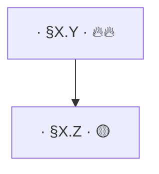

# Concept Graph Skill

## Overview

This skill documents the **contract schema** for `course-index/concept-graph.md` and the **validation rules** that any producer or consumer of that file must honour.

The invariant is: **the Markdown tables are the contract**; the `## Rendered graph` mermaid block is render-only and is ignored by the parser (`parseConceptGraph` in `packages/paideia-core/src/conceptGraph.ts`).

## §2.2 Contract schema (verbatim — do not deviate)

```markdown
# Concept Graph — <course name>

<!-- SOURCE: course-index/concept-graph.md method: llm-concept-graph, model: <engine> -->

## Focus question

<One prose sentence that frames the graph's scope.>

## Nodes

| Concept | id | § | Patterns | Tier | Type | Source |
|---|---|---|---|---|---|---|
| <concept name> | C1 | §X.Y | P4, P7 | 🔥🔥 | conceptual | converted/lectures/chNN.md |
| <concept name> | C2 | §X.Z |         | 🟡   | procedural | converted/lectures/chNN.md |

## Prerequisite edges

| From | To | Confidence | Rationale |
|---|---|---|---|
| C1 | C2 | 0.90 | <one-sentence linking phrase> |

## Cross-links

| A | B | Relation |
|---|---|---|
| C1 | C3 | <non-prerequisite relation phrase> |

## Rendered graph


```

### Column semantics

| Column | Semantics |
|---|---|
| `Concept` | Human-readable concept name |
| `id` | Sequential identifier C1..Cn, stable across edits |
| `§` | Section anchor (§X.Y, Ch N.M, or Lecture N) — verbatim from source |
| `Patterns` | Comma-separated Pk IDs from `course-index/patterns.md`; empty if none |
| `Tier` | Exam tier: 🔥🔥 = primary, 🔥 = likely, 🟡 = possible, ⚪ = low. Sourced from `coverage.md` §-join |
| `Type` | `conceptual` (definition/theorem) or `procedural` (solution technique) |
| `Source` | Relative path of the file where the concept is first defined |
| `From` / `To` | Node ids (must exist in `## Nodes`) |
| `Confidence` | Float in [0, 1]; 0.75 for structural-prior edges, higher for confirmed LLM edges |
| `Rationale` | One-sentence linking phrase |
| `A` / `B` | Node ids for a non-prerequisite cross-link |
| `Relation` | Relation label (e.g. "shares characteristic polynomial") |

## §2.4 Validation contract (four mandatory checks)

Any producer of `concept-graph.md` MUST verify all four before writing the file:

1. **Edge id existence**: Every `From` and `To` in `## Prerequisite edges` must match an `id` in the `## Nodes` table. Missing ids → validation error.

2. **Acyclicity**: The prerequisite edge graph must be a DAG. Run Tarjan SCC; if any SCC has size > 1, the graph is cyclic and must not be written as-is. Fix by merging near-synonyms or removing the lowest-confidence edge in the cycle.

3. **Tier vocabulary**: Every `Tier` cell must be exactly one of: `🔥🔥`, `🔥`, `🟡`, `⚪`. Retired values (`✅`, `🔴`) and free text are rejected.

4. **Confidence range**: Every `Confidence` value must parse as a float in [0.0, 1.0] inclusive. Out-of-range values → validation error.

## Decision Ledger: `verdict: reject` recording rule

When the validator rejects an edge (any of the four checks above), record a `verdict: reject` entry in the Decision Ledger (append-only log). The schema follows `decision_ledger` DDL from the gap-matrix §4:

```json
{
  "ts": "<ISO 8601 timestamp>",
  "source": "concept-graph-validator",
  "check": "edge_id_existence | acyclicity | tier_vocabulary | confidence_range",
  "from": "<node id or null>",
  "to": "<node id or null>",
  "detail": "<human-readable reason>",
  "verdict": "reject"
}
```

Rejected entries are append-only. They are never deleted or modified. The validator logs both the issue and the corrective action taken (edge removal, node merge, etc.) as a second entry with `"verdict": "auto_fixed"`.

## Fringe algorithm seam (§2.7)

`packages/paideia-core/src/conceptGraph.ts` provides the following pure functions (no probabilistic logic, no optimiser):

- `outerFringe(g, mastered)` = `{ c ∉ mastered : prereqs(c) ⊆ mastered }` — concepts ready to learn next
- `innerFringe(g, mastered)` = `{ c ∈ mastered : S\{c} is still downward-closed }` — boundary of mastered set
- `foundationalCracks(g, mastered)` = `{ c ∈ outerFringe(g, mastered) : ∃ descendant d, tier(d) = 🔥🔥 }` — unlearned concepts blocking high-stakes topics

`mastered` is supplied by the caller as a set of concept ids determined from artifact facts (graded drills + recent `errors/log.md` no-error). No BKT, no Bandit, no CP-SAT — PLOM exclusion (doc 04 §0.4).

`gateByFringe` (schedule-layer consumer) is defined in `packages/schedule` (doc 03), not here. This skill only documents what the pure functions provide.

## PAIDEIA contract invariants

- **Tier vocabulary**: The canonical set 🔥🔥/🔥/🟡/⚪ is shared with `coverage.ts`. `⚠weak` is a flag on coverage rows, not a tier, and does not appear in concept-graph tier cells.
- **§ anchors**: Section anchors are verbatim from source — `weakmap`, `hwmap`, `quiz` regex patterns must not be broken.
- **Pk identifiers**: Pattern IDs in the `Patterns` column are verbatim from `patterns.md`. Do not rewrite them.
- **`errors/log.md` contract**: The 6-key append-only contract is unaffected. Concept graph validation logs go to the Decision Ledger, not to `errors/log.md`.
- **Local-first invariant**: Only the pure Markdown file `course-index/concept-graph.md` is written to the course folder. No `.db`, no `.json`, no derived files. The mermaid block in the file is human-readable render — not parsed.
- **Wikilink option (Obsidian interop)**: The `Concept` cell in `## Nodes` MAY optionally be wrapped as `[[<concept name>]]` for Obsidian wikilink resolution. The parser (`parseConceptGraph`) treats the cell as a raw string and passes `zod .min(1)`, so this is parser-transparent. Do NOT use wikilinks inside mermaid labels — mermaid interprets `[[` as subgraph syntax and will break rendering. / `Concept` 셀만 위키링크 감싸기 가능; mermaid 라벨 내 `[[]]` 금지.
- **`## Concept heatmap` section (render-only)**: The `/paideia:graph` command may append a `## Concept heatmap` section after `## Rendered graph`. This section is **render-only and is not parsed by `parseConceptGraph`** — the `sectionKind` function returns `"other"` for it and the parser ignores all table rows in `"other"` sections. It contains observation-only counts (no BKT/Bandit/CP-SAT) joined from `errors/log.md` by pattern Pk and § anchor. / 파서가 읽지 않는 render-only 섹션; 관측 카운트만(PLOM 금지).
